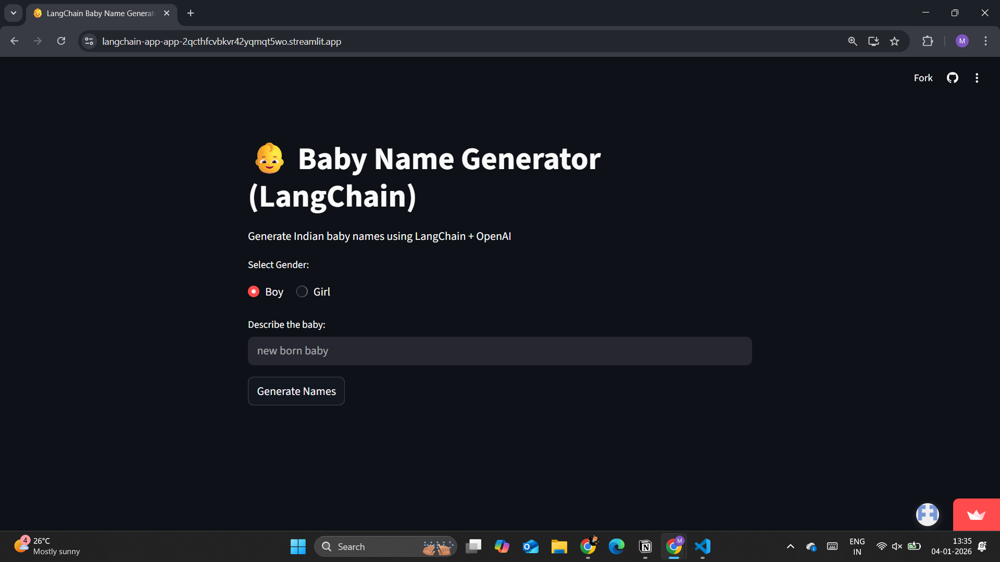
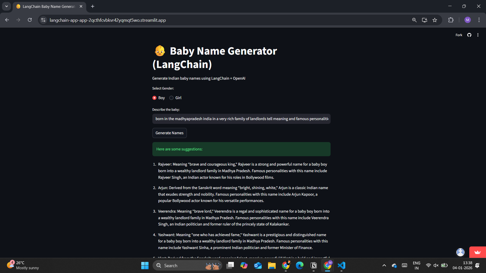

# 👶 Baby Name Generator  
### *LangChain · OpenAI · Streamlit*

🚀 **Live Demo**  
👉 https://langchain-app-app-2qcthfcvbkvr42yqmqt5wo.streamlit.app/

An **AI-powered web application** that generates **meaningful Indian baby names** based on gender and contextual preferences.  
This project demonstrates **real-world application of Large Language Models (LLMs)** using **LangChain Expression Language (LCEL)** with a clean **Streamlit-based UI** and secure **cloud deployment**.

---

## 🔍 Project Overview

Choosing a baby name is culturally significant and deeply personal.  
This application leverages **OpenAI-powered LLMs** through **LangChain (LCEL)** to generate **context-aware Indian baby names**, enriched with:

- Semantic meaning of names  
- Cultural and regional relevance  
- User-specific contextual personalization  
- Famous personalities sharing the same name  

The application is **deployed on Streamlit Community Cloud**, following **production-grade best practices** for secrets management and version control.

---

## ✨ Key Features

- 👶 AI-generated Indian baby names  
- 🚻 Gender-based selection (Boy / Girl)  
- 🧠 Context-aware generation (region, family background, values)  
- 📖 Name meanings with notable personalities  
- 🔗 Built using **LangChain Expression Language (LCEL)**  
- 🎨 Interactive and responsive Streamlit UI  
- 🔐 Secure API key handling using environment variables  
- ☁️ Cloud deployment on Streamlit Community Cloud  

---

## 🖼️ User Interface Preview

> Screenshots of the deployed application

```md



🛠️ Tech Stack
Python 3.10+

LangChain (LCEL architecture)

OpenAI API

Streamlit

dotenv

Git & GitHub

Streamlit Community Cloud

📂 Project Structure
text
Copy code
langchain-streamlit-app/
│
├── app.py                # Streamlit UI entry point
├── requirements.txt      # Python dependencies
├── README.md
├── .gitignore
│
├── images/               # UI screenshots for documentation
│
└── src/
    ├── __init__.py
    ├── main.py           # LangChain LCEL pipeline logic
    └── rag.py            # Supporting / future RAG extensions
⚙️ Installation & Local Setup
1️⃣ Clone the Repository
bash
Copy code
git clone https://github.com/ManthanAdsul/langchain-streamlit-app.git
cd langchain-streamlit-app
2️⃣ Create & Activate Virtual Environment
bash
Copy code
python -m venv venv
Activate

bash
Copy code
# Windows
venv\Scripts\activate

# macOS / Linux
source venv/bin/activate
3️⃣ Install Dependencies
bash
Copy code
pip install -r requirements.txt
🔐 Environment Variables
Create a .env file in the project root:

env
Copy code
OPENAI_API_KEY=your_openai_api_key_here
⚠️ Never commit .env files to GitHub

☁️ Streamlit Cloud Secrets
For deployment, add the key via:

nginx
Copy code
Manage App → Settings → Secrets
toml
Copy code
OPENAI_API_KEY = "sk-xxxxxxxxxxxxxxxxxxxx"
▶️ Running the Application
bash
Copy code
streamlit run app.py
🧠 How It Works (Architecture)
text
Copy code
User Input (Streamlit UI)
        ↓
Streamlit Application (app.py)
        ↓
LangChain LCEL Pipeline (src/main.py)
        ↓
OpenAI Chat Model
        ↓
Structured AI Response (Names + Meanings)
Under the Hood:
Uses LangChain Expression Language (LCEL) for composable chains

Dynamic prompt construction based on user context

Clean separation of UI and AI logic for scalability

🧪 Example Input
text
Copy code
Gender: Boy
Context:
Born in Madhya Pradesh in a wealthy landlord family.
Include meanings and famous personalities.
✅ Sample Output
Rajveer — Meaning: Brave king
Famous personality: Rajveer Singh (Indian actor)

Arjun — Meaning: Bright / shining
Famous personality: Arjun Kapoor (Bollywood actor)

Veerendra — Meaning: Brave lord
Famous personality: Veerendra Heggade (Philanthropist)

Yashvardhan — Meaning: Glory of the king
Famous personality: Yashvardhan Ahuja (Actor)

Viraj — Meaning: Illustrious
Famous personality: Viraj Dayal (Musician)

🧠 Skills Demonstrated

LLM application development

Prompt engineering

LangChain LCEL pipelines

Secure API key management

Cloud deployment (Streamlit Community Cloud)

Git & GitHub best practices

🚀 Future Enhancements
🔍 RAG-based name suggestions using curated datasets

🌐 Multi-language support

📜 Cultural & historical explanations

☁️ CI/CD-enabled cloud deployment

🧩 Modular prompt templates

🎯 Why This Project Matters (Resume Value)
This project demonstrates:

Designed and implemented a production-ready LLM application

Used modern LangChain (LCEL) architecture

Integrated AI backend with interactive frontend

Implemented secure secrets management

Deployed an AI application to the cloud

Followed clean Git and project structuring practices

👤 Author
Manthan Mahendra Adsul
Final-year Engineering Student
Focused on AI, Automation, and Applied LLM Systems

🔗 GitHub: https://github.com/ManthanAdsul

🔗 LinkedIn: https://www.linkedin.com/in/manthan-adsul/

📧 Email: manthanadsul1@gmail.com

📄 License
This project is intended for portfolio purposes.